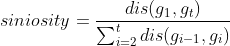
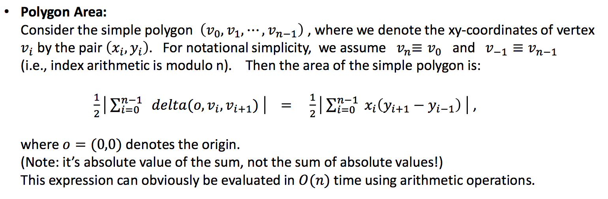

# animal_range_Cibils
Projects on animal range science with Dr. Cibils

The program is consists of three parts:  
-------------------------------------
- **range_speed**. Given the GPS records, time, and weather information, The program calculates the distance traveled, path sinuosity, woodland preference index, convex hull points, convex hull area, and the time slots of the activities for each cow.
- **range_partition**. It partitions a GPS data collection of cows into three periods (pre-day, daytime, post-day) based on a given time file.
- **range_pixel**. Given the pixel file that contains the range geographic information and the GPS records, it calculate the percent grazed pixels, and pixel residence time, revisit rate (visits on different days), and return interval (interval between visits when cows visited the same pixel for more than once) by considering the velocity of the cow. The cow velocity is calculated by two consecutive gps records. 

execution of the code and the input files:
-------------------------------------
- The programs are also named by the Agriculture department as the **GRAZEACT** refers the program calculates activity parameters from GPS data of grazing animals, and **GRAZEPIX** refers the code tracks pixel use from GPS data of grazing pastures.  
- For the convenience of stuffs, students and researchers who are no familiar with the programming, The program is complied to **JAR** files. The input files are put with the same folder of the jar file. 
	- the code can be executed by java command directly, e.g. `java -jar range_project.jar`
	- If you are coding by using IDE, put all the input files under the root folder of the project. 
	- The responding input files can be found found in the [data](data) folder. 
- Details usages of the **range_pixel** can be found in the [instruction](Tutorial/instructions-v2.pdf).
- Compile the executable Jar Files:
	- change the line `<mainClass>*****</mainClass>` to point the main function as desire (e.g. `speed_pixel.speed_pixel`) in the file 'pom.xml'.
	- compile with the `mvn` command, `mvn clean package`. 
	- rename the jar file, `~/target/.*-with-dependencies.jar`.
	- The corresponding mapping from the main function to the jar file could be 
		- `range_pixel.range_pixel` >>> GRAZEPIX
		- `range_speed.AnimalProject` >>> GRAZEACT
		- `range_partition.range_partition` >>> GRAZEPartitio

Summary of the logics:
-------------------------------------
1. **range_speed**. 
	1. All the GPS data are read from the data file, and are stored and sorted by cowid, data, time.
	2. The program is coded by *Aditay* calculates the distance traveled, path sinuosity, woodland preference index. 
	    1. The siniosity is the ratio between the distance from the first gps record to the last records and the 
	    cumulative distance of the whole day/pre-day/day-time/post-day's GPS records.  
	    , where $g_i$ is one GPS record at time i and t is 
	    the total number of GPS records of the whole day/pre-day/day-time/post-day.
	    2. The woodland visitation is the percentage of the number of time the cow visied the woodland during the 
	    whole day/pre-day/day-time/post-day.
	    3. The weather information is added as well. 
	    4. The outputs are *DistanceandSiniosity.csv* and *CompleteProcessedData.csv* (with speed and weather 
	    information).;
	3. The code of the convex hull is calculate following [Andrew's monotone chain convex hull algorithm](https://en.wikibooks.org/wiki/Algorithm_Implementation/Geometry/Convex_hull/Monotone_chain). The function accept the GPS locations of one cow, the vertices of the convex hull are returned. The complexity for calculation on two-dimensional space is O(nlog(n)).
	4. The returned points are used to calculate the area of convex hull by using following formula.
	
	5. Given two velocity parameters, one for walking `v_walking`, one for running `v_running`. The velocity of a cow is computed by two consecutive GPS records. If the cow's velocity is [0,`v_walking`], we assume the cow was resting. Similarly, if the cow's velocity is (`v_walking`, `v_running`], the cow is assumed that it was walking. If the speed of the cow is greater that `v_running`, we think the cow is running. 
	6. The function `movementParitionForCow` counts the percentage of each cow that was resting, walking and running during the whole day, the pre-day, the daytime, and the post-day according given time date.
	7. The function `time_slot` identifies the activity time slots of the each cow in each day. **The logic need some time to figure out.** 
2. **range_partition**.  
	The time file contains the informations of the time of sunrise and sunset. All the GPS records are divided into *pre.csv*, *day.csv*, and *post.csv*, which contains the time of the GPS records that is before the sunrise, between the sunrise and sunset, and after the sunset, respectively. 
3. **range_pixel**.
	1. The pixel file contains the geographic information of the pasture. The parameter `meters of the range` controls the size of the each pixel square.  
	2. The velocity is computed by two consecutive GPS records as well. If the speed of the cow is between given thresholds `min_speed` and `max_speed`, we think the cow revisited back to one pixel. Otherwise, we think the cow just ran through or rested one pixel.
	3. Details usages can be found in the [instruction](Tutorial/instructions-v2.pdf).
	
Citation:
---------------------------------------
<pre>@inproceedings{gong2020grazetools,
title={GRAZETOOLS: A Set of Tools for Analyzing Livestock Behavior Using GPS data},
author={Gong, Qixu and Cao, Huiping and Cibils, Andres and Nyamuryekung'e, Shelemia and McIntosh, Matthew and Continanza, Fatima},
booktitle={AGU Fall Meeting 2020},
year={2020},
organization={AGU}
}</pre>