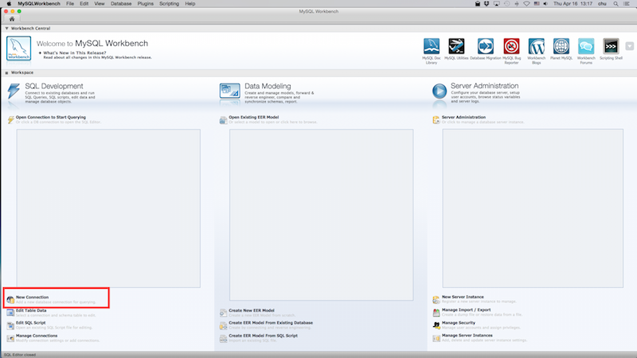
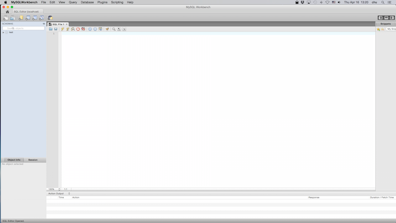
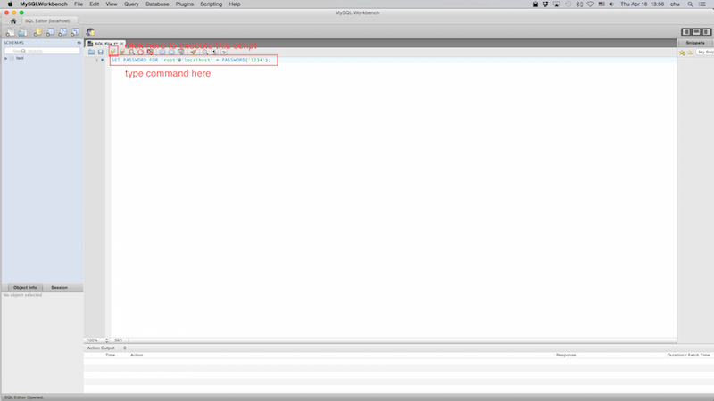
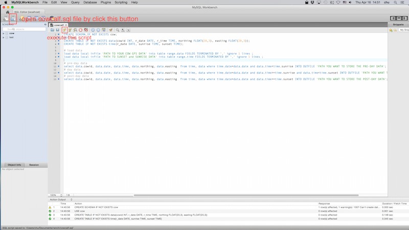

Tools for cow data partitioning
=================================

Tool description
-------------------

This tutorial presents how to partition a GPS data collection of cows into 3 period by utilizing MySQL database management system.

The GPS data contains GPS coordinates for each cow over a whole day.  One day can be divided into 3 period: pre-sunrise, day time and post sunset.
This tutorial shows the instructions of using MySQL database management software to partition the data into 3 periods: pre-sunrise, day time and post sunset.
The results can benefit other range research that works on a certain period of the GPS data. 

Download and install MySQL and MySQL workbench
----------------------------------------------

1.  Download and install MySQL from [link](http://dev.mysql.com/downloads/mysql/)

2.  Download and install MySQL workbench from [link](http://dev.mysql.com/downloads/workbench/)

Create a new connection to MySQL database
-----------------------------------------

1. Open MySQL workbench

   [](fig/mysql-workbench-1.png)
   click to zoom in

2. Click new connection button

   [](fig/mysql-workbench-2.png)
   click to zoom in

3. Name the new connection

   [](fig/mysql-workbench-3.png)
   click to zoom in

4. Double click new connection, you will see a new window opened

   [](fig/mysql-workbench-4.png)
   click to zoom in

Create a new database for your cow data
---------------------------------------

Setup password for root user (optional)
in the new opened SQL File window, type

```
SET PASSWORD FOR 'root'@'localhost' = PASSWORD('newpwd');
```

[](fig/mysql-workbench-5.png)
click to zoom in

Then click execute button to execute the script.

Preprocessing the data
----------------------

1. Convert your GPS data into csv format and use comma as delimiter.
   In total the csv file should only have 5 columns.  They are:
   CowID,Date,Time,northing,easting

   *  CowID is an integer.  
   *  The format of Date is yyyy-mm-dd.  
   *  The format of Time is hh-mm-dd.
   *  Northing and easting are float numbers.

   [Here](files/range_partition/2007Data.csv) is an example of GPS data.

2. Convert your sunset/sunrise data into csv format and use comma as delimiter.
   In total the csv file should only have 3 columns.  They are: Date,Sunrise,Sunset
   *  The format of Date is yyyy-mm-dd.  
   *  The format of sunrise and sunset is hh-mm-dd.

   [Here](files/range_partition/2007Time.csv) is an example of time data.

3. Open [cowcalf.sql](./files/range_partition/cowcalf.sql) file from MySQL workbench.

   [](fig/mysql-workbench-6.png)
   click to zoom in

   1.  Specify the path of input GPS data and sunset/sunrise data.
   2.  Specify the path of output data: pre.csv, day.csv, post.csv.
   3.  Execute cowcalf.sql.  The GPS data will be partitioned into 3 period and written to the output data file specified by step 2.
